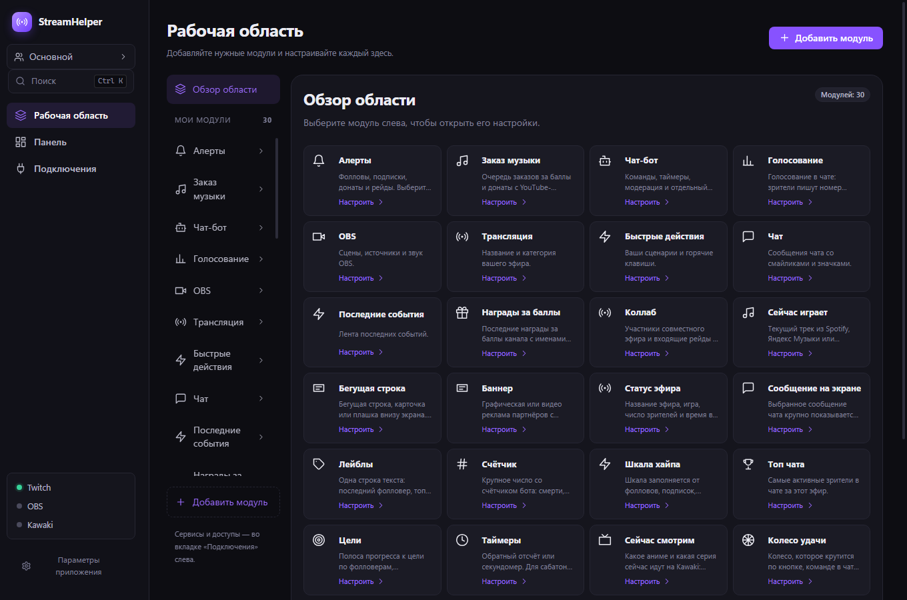
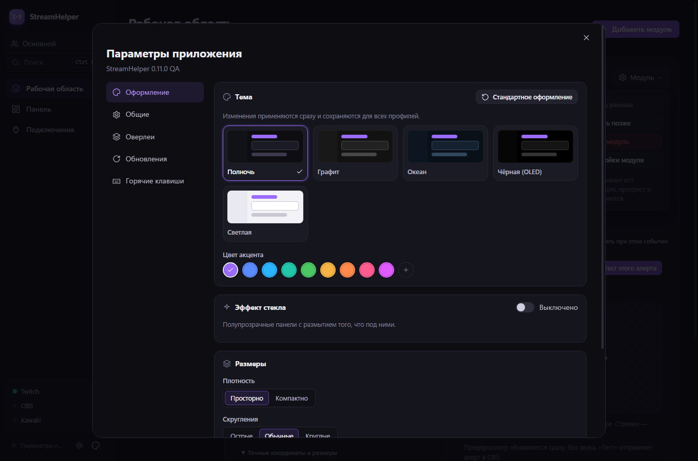
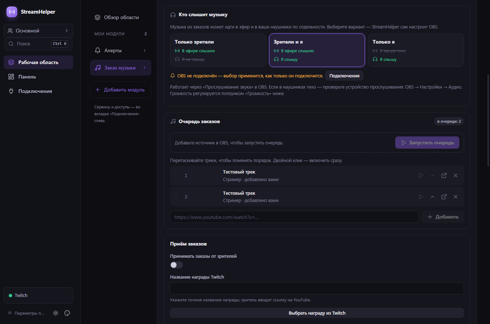
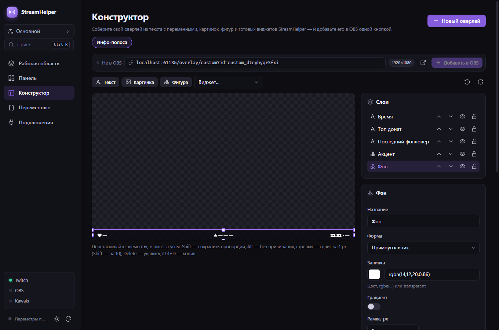
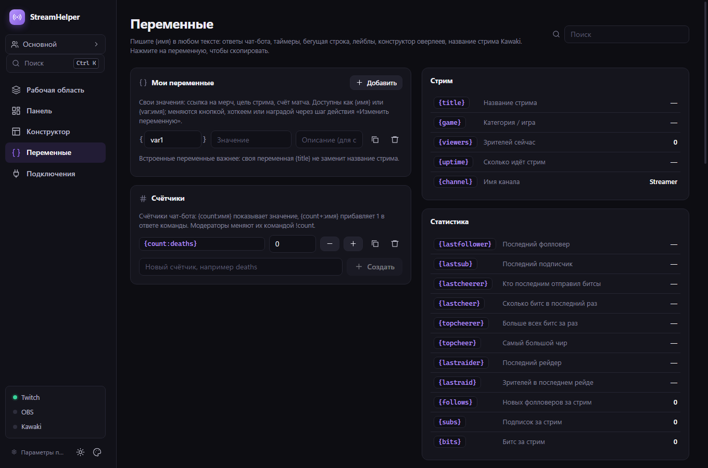
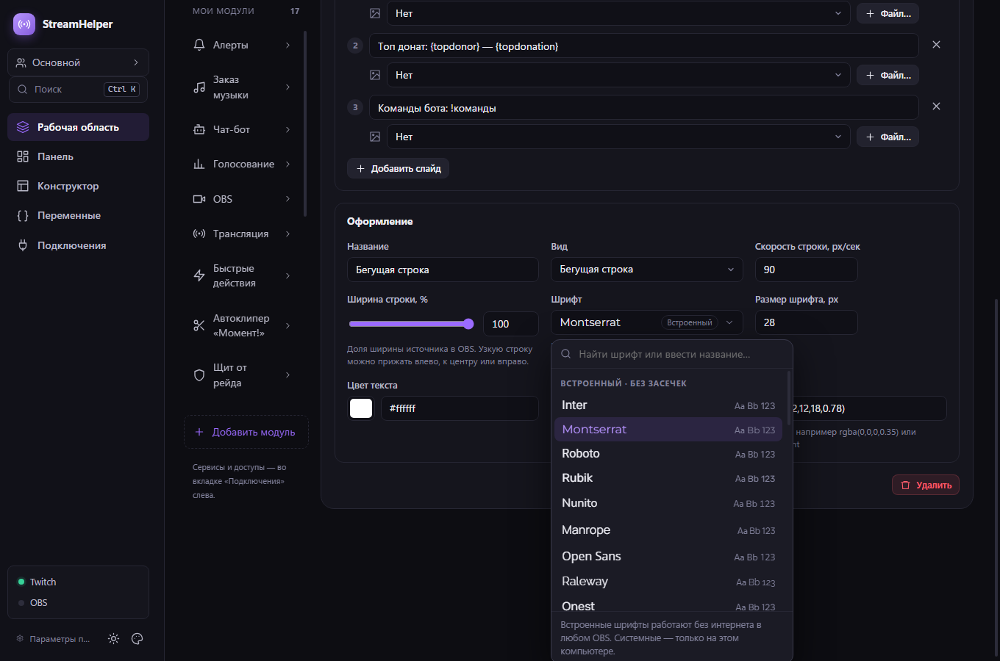

# StreamHelper

[Русский](README.md) · [English](README.en.md)

StreamHelper is a Windows desktop app for managing a stream, chat, and OBS browser sources from one place. Current version: **0.12.1**. The interface supports Russian and English.

Patch **0.12.1** makes the newer overlays (curses, music duel, guess the melody, stock exchange, portal) visible in OBS again for profiles created before they existed. Release **0.12.0** added a font picker to every module (30 bundled fonts, installed fonts and Google Fonts), a Donations module, a StreamHelper group and separate settings per OBS scene, the Designer (custom overlays) and Variables tabs, Kawaki login in Connections, and the stream tools pack: auto clipper, curses, music duel, guess the melody, music ducking, viewer stock exchange, portal, stream recap and raid shield. [Verification report (Russian)](docs/verification-0.12.0.md).

> **Upgrading from 0.11.x:** "Add to OBS" now puts sources into a nested scene "StreamHelper · <scene>". Sources you already added stay where they are; move them into the group with the button in the OBS module, or turn the group off in **Connections → OBS**. Reconnect Twitch for clips and the raid shield.

Releases are available [in this repository](https://github.com/Rayness/StreamHelper/releases) and in the [public update repository](https://github.com/Rayness/StreamHelper-Releases/releases).

## Screenshots

These screenshots use fictional demo data; they contain no real accounts or tokens.

**Workspace, appearance and song requests:**







**Overlay designer, variables and font picker:**







## Download and first run

1. Download `StreamHelper-Setup-0.12.1.exe` from [release 0.12.1](https://github.com/Rayness/StreamHelper/releases/tag/v0.12.1) or the [update repository](https://github.com/Rayness/StreamHelper-Releases/releases/tag/v0.12.1). The Windows installer is currently unsigned.
2. Open **Connections → Twitch** and sign in as the broadcaster. Authorization uses a device code on Twitch.
3. If needed, open **Connections → OBS** and enter its WebSocket address, port and password. The usual port is 4455.
4. Add the features you need: Alerts, Chat, Song Requests or individual activities. Select an added module to configure it and use **Add to OBS** for its browser source.
5. Use **Monitor** to follow progress. In **Customize monitor**, drag blocks by their header, resize them from the bottom-right corner and choose which blocks are visible. Connect a separate bot account in **Connections → Twitch → Bot account**.

Keep StreamHelper running during the stream. Its local server on `127.0.0.1` serves the overlays and updates them over WebSocket. The default port is 4848; change it in **App preferences** if needed. The app can stay in the system tray when its window is closed.

### App sections

| Surface | What it does |
| --- | --- |
| Workspace | Add, configure and manage only selected modules. Each profile has its own module list. |
| Connections | Twitch, bot account, OBS and donation services. Shared across profiles. |
| Monitor | Status and progress on a free grid; blocks never overlap. Layout is saved per profile. |
| Profile picker | Create a fresh or copied profile, rename, switch and delete profiles. |
| App preferences | Appearance (theme, accent, glass, density, scale), language, currency, tray behavior, local server port, updates and the shortcut list. Appearance is shared by all profiles. |

Shortcuts: `Ctrl+1`/`Ctrl+2`/`Ctrl+3` open Workspace, Monitor and Connections; `Ctrl+,` opens preferences; `Ctrl+Shift+L` toggles light and dark. Press `Ctrl+K` to search added modules and their actions. Removed modules cannot be configured through search or old shortcuts; their settings and progress are preserved.

## OBS overlays

Each overlay is a separate OBS Browser Source. Each added widget module shows its recommended size, preview, URL and connected-source count.

| Source | Content |
| --- | --- |
| Alerts | Follows, subscriptions, Bits, raids, donations, and rewards. |
| Chat | Messages, emotes, badges, timestamps, reply context, and animations. Background styles include card, glass, gradient, outline, neon, stripes, speech bubble, and transparent; you can add your own image. |
| Recent events | A compact channel activity feed. |
| Channel rewards | Recent Twitch custom reward redemptions with viewer, title, cost, and optional response. |
| Collab | A manually entered list of co-stream guest channels and incoming raids. |
| Now Playing | Track, artist, artwork, album, and progress from Windows media sessions. Supports Spotify, the Yandex Music app, and browser players. |
| Song requests | A YouTube player and queue for channel rewards, donations, and manual requests. |
| Ticker | Scheduled text, card, or lower third. |
| Banner | Sponsor images and videos with a separate schedule and 14 entrance effects. |
| Live status and chat spotlight | Title, category, viewers, uptime, or one selected chat message. |
| Goals, timers, and labels | Donations, followers, subscriptions, new chat message and unique chatter goals, subathon, and template variables. |
| Counter | A bot counter (deaths, wins...) as a card, text, or badge. |
| Hype meter | Fills up from follows, subs, bits, donations, raids, rewards, and chat, cools down over time, with levels. |
| Top chatters | The most active viewers of the stream; bots are excluded. |
| Interactive sources | Wheel, poll, giveaway, viewer queue, guess the number, boss, quiz, and emote rain. |
| Kawaki | Current title, poster, and viewing progress. |

**Channel points:** StreamHelper subscribes to Twitch's `channel.channel_points_custom_reward_redemption.add` event when custom rewards are available and the broadcaster grants `channel:read:redemptions`. Twitch's built-in rewards do not appear in this feed. A custom reward title can also trigger a wheel spin, boss hit, or quick action. If Twitch does not provide these events, the reward overlay stays empty without affecting other features.

**Collaborations:** enter one Twitch guest channel per line. The card updates without reloading OBS. Incoming raids are added when Twitch sends raid events. Shared chat and control of another broadcaster's channel are not connected automatically.

**Music:** open **Overlays → Now Playing** and add the source to OBS. Auto mode selects an active session, preferring Spotify, then the Yandex Music app, then a browser. You can pin a source and adjust the horizontal or vertical layout, artwork and title size, background opacity, accent color, source label, album, and progress. The card hides on pause by default. StreamHelper reads local Windows media sessions, so no Spotify or Yandex sign-in is needed. Yandex Music in Chrome or Edge appears as “Browser” because Windows does not provide the tab URL. If several tabs in one browser play at once, a specific tab cannot be selected.

**Song requests:** open **Overlays → Song requests**, add its separate OBS Browser Source, and enable viewer requests. Set the exact title of a custom Twitch reward; viewers enter a link to an individual YouTube video. For donations, set a minimum in the main currency; the donation message must contain the link. DonationAlerts, Streamlabs, and StreamElements are supported. The queue survives restarts and can advance automatically or be controlled from the app and OBS dock. Choose full-size video, compact visible video beside request details, or queue-only mode with no YouTube video or audio in OBS. Adjust volume, player controls, requester and title labels, queue count, compact video position and size, accent color, and background opacity. YouTube playback requires a visible video; queue-only mode keeps requests ready until you switch back or play them in another player. StreamHelper can pause the active Windows media session and resume it after the queue. The YouTube video must allow embedding and be reachable from the OBS computer.

Links are checked with YouTube before queueing: removed, private and embed-blocked videos are rejected, and the viewer gets a chat reply with their queue position or the reason. A video that still fails to play is skipped. Manage the queue in the module: drag to reorder, Play now, Play next, pause.

**Point refunds:** **Create reward on Twitch** in the module makes a reward that StreamHelper manages. Rejected, unplayable and removed requests are refunded; played ones are marked fulfilled. This needs the `channel:manage:redemptions` scope: if Twitch was connected before 0.11.0, reconnect it. A reward created by hand in the Twitch dashboard still works for requests, but Twitch does not let the app refund it.

**Who hears the music:** Viewers only, Viewers and me, or Only me. Every time OBS connects, StreamHelper turns on OBS audio control for all Song Request sources and sets their audio monitoring, so a monitoring mode set by hand in OBS is overwritten. The default is Viewers only. For Viewers and me, make sure OBS Desktop Audio does not capture the monitoring device, or the music reaches the stream twice.

**Chat activities:** in **Overlays → Goals**, choose Chat messages or Unique chatters. Bot commands and messages sent by StreamHelper do not count. Each person counts once per goal; resetting the count clears that goal's participant list.

**Profiles:** open the profile picker on the left. **New profile** starts with an empty workspace and default feature settings; **Create copy** keeps the current setup. Workspace modules, monitor layout and feature settings are independent. Service connections are shared.

**Messages on screen:** under **Overlays → Message on screen**, choose a single card, a stack, or falling messages. Gravity and bounce are adjustable. Highlighted Twitch messages can appear automatically, and sample messages work without a live stream. Use a 1920×1080 browser source for a full-screen fall.

**Donations:** add amount tiers under **Alerts → Donation**. Each tier has its own text, image, sound, and animation; the highest matching threshold applies. You can position each alert with X/Y coordinates, width, and an anchor, including per-tier positions. Donation goals can filter providers, require a minimum, and cap the contribution from one donation.

## Connections and automation

| Service | Setup |
| --- | --- |
| Twitch | Broadcaster Device Code sign-in; optional separate bot login. Provides chat, EventSub events, and stream information. |
| OBS Studio | Local obs-websocket v5. Enable WebSocket Server in OBS and enter its address, port, and password inside its workspace module. |
| DonationAlerts | Authorize in the app. If the built-in Client ID is unavailable, enter your own under advanced settings. |
| Streamlabs | Paste your Socket API Token. |
| StreamElements | Paste the Channel ID and JWT from StreamElements → Account → Channels. The app accepts completed, approved Astro tips. |
| Streamer.bot | Enable its HTTP Server and enter the port (usually 7474) inside its workspace module. Assign actions to quick buttons, hotkeys, or channel rewards. |
| Discord | Create a text-channel webhook and paste its URL. You can enable live announcements and donation notifications and send a test message. |
| Kawaki | Sign in through `kawaki.ru/link` for the now-watching overlay, `!аниме` command, and stream-title template. If player data is unavailable, the most recent title in Watching is used. |
| SubForStream | Run SubForStream, then enable the integration under **OBS & actions** and set its local port (usually 5000). Add its caption overlay to OBS and clear captions from StreamHelper. |

Twitch is currently the implemented chat platform. The `ChatPlatform` interface allows future YouTube, VK Play Live, and Kick connectors; working connectors for those services are not yet included.

### OBS dock

In StreamHelper, open **OBS & actions → StreamHelper dock for OBS** and copy the URL. In OBS, choose **View → Docks → Custom Browser Docks**, give the dock a name, and paste the URL. The dock has sections for live OBS controls, alerts and on-screen messages, interactive activities, and music/tools. You can switch profiles there as well. The URL contains a random access key: treat it like a password and replace it in OBS if you change the overlay port.

## Updates and local data

Installed 0.4.x versions check for updates after launch and every six hours. Downloads happen in the background; you choose when to install and restart from **Settings** so a live stream is not interrupted. Update assets are served from the [public release repository](https://github.com/Rayness/StreamHelper-Releases/releases). Version 0.2.0 and older must be upgraded with an installer once.

User data is stored in `%APPDATA%\StreamHelper`: `settings.json` holds settings, `secrets.bin` holds tokens encrypted by Windows, and `media/` holds imported sounds, images, and videos. To move settings, close the app and copy this directory. Moving `secrets.bin` between Windows users may require signing in again.

The overlay server listens only on `127.0.0.1`. The OBS dock has its own access key. Ordinary overlay URLs are intended for local OBS use; do not expose the server port to the internet without your own protection.

## Troubleshooting

- **Blank overlay:** confirm StreamHelper is running and the source URL uses the current port. Some sources wait for an event or manual display.
- **No channel rewards:** sign in as the broadcaster again to grant the required scope and check that the channel has a custom reward. Built-in rewards are not supported.
- **"No permission to manage rewards" when creating a reward:** reconnect Twitch in **Connections** to grant `channel:manage:redemptions`.
- **Requested music plays twice or echoes on stream:** "Who hears the music" includes you, and OBS Desktop Audio captures the same device as monitoring. Choose Viewers only or change the monitoring device in OBS → Settings → Audio.
- **OBS controls unavailable:** enable OBS WebSocket Server and check the port and password.
- **No music shown:** play a track on this PC, check the detected sources, and try Auto or Browser. Some players do not publish a Windows media session, so their tracks cannot appear.
- **SmartScreen or antivirus warning:** the installer is not yet publisher-signed. Compare its SHA-256 with the checksum in the release.
- **Dock stopped working after a port change:** copy the new URL from StreamHelper into OBS's custom dock settings.

## Development

Development requires Node.js and npm; building the installer requires Windows. The app uses Electron, React, and TypeScript.

```powershell
npm install
npm run dev
npm run typecheck
npm test
npm run build
npx electron-builder --win --publish never --config.directories.output=dist/0.8.0
```

Generated Windows Runtime bindings are included in the repository; a normal build does not need the Windows SDK. To regenerate them on a machine with the Windows SDK, run `npm run generate:winrt`. Building an installer does not publish it. To validate and publish an update release:

```powershell
powershell -NoProfile -ExecutionPolicy Bypass -File scripts/publish-release.ps1 -ValidateOnly
powershell -NoProfile -ExecutionPolicy Bypass -File scripts/publish-release.ps1
```

Before publishing, ensure the versions in `package.json`, the installer, and `latest.yml` match. The script checks the installer and blockmap and requires the update repository to be public. To register your own Twitch client, use the [Twitch Developer Console](https://dev.twitch.tv/console/apps), choose **Public**, and set OAuth Redirect URL to `http://localhost`. Enter its Client ID in the app or `DEFAULT_TWITCH_CLIENT_ID` in `src/shared/defaults.ts`. A DonationAlerts client needs Redirect URI `http://127.0.0.1:4848/auth/donationalerts` and a Client ID. These authorization flows do not require client secrets in StreamHelper.

For a signed release, provide a Windows code-signing certificate (`.pfx`/`.p12`) through the `WIN_CSC_LINK` and `WIN_CSC_KEY_PASSWORD` environment variables; never commit the certificate or password. Build the installer with `--config.forceCodeSigning=true`. The publish script requires a trusted Authenticode signature by default. The project owner can explicitly allow an unsigned release with `-AllowUnsigned`; version 0.7.0 was published this way. See the [electron-builder signing guide](https://www.electron.build/v26/docs/features/code-signing/).

### Project structure

```text
src/shared/              Types, settings, defaults, templates
src/main/                Electron main process, services, IPC
src/main/platforms/      Twitch and the chat-platform interface
src/main/donations/      Donation services
src/main/obs/            OBS control
src/main/overlay/        Local HTTP/WebSocket server and OBS dock
src/main/features/       Alerts, interactive tools, advertising, stats, actions
src/renderer/            React UI
resources/overlays/      OBS browser-source pages
tests/                   Unit and integration tests
```

Services normalize messages and events into `ChatMessage` and `StreamEvent` and publish them through `EventBus`. The alert queue, bot, interactive features, overlays, and UI subscribe to that bus.

## License

MIT — see [LICENSE](LICENSE).
