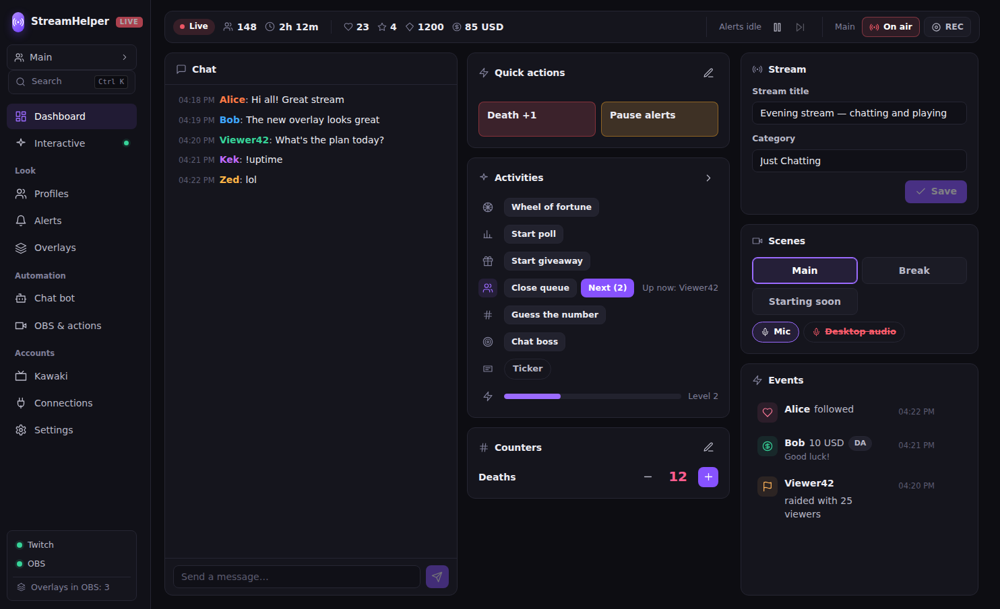
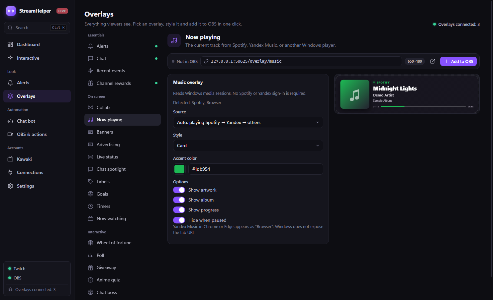
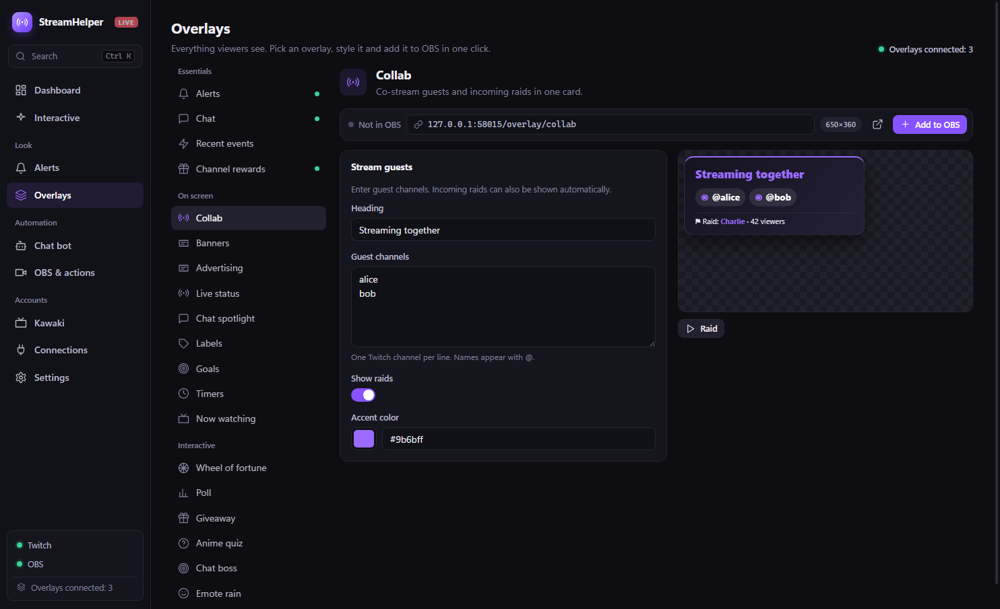

# StreamHelper

[Русский](README.md) · [English](README.en.md)

StreamHelper is a Windows desktop app for managing a stream, chat, and OBS browser sources from one place. The latest published release is **0.6.0**. The interface supports Russian and English.

Releases are available [in this repository](https://github.com/Rayness/StreamHelper/releases) and in the [public update repository](https://github.com/Rayness/StreamHelper-Releases/releases).

## Screenshots

These screenshots use fictional demo data; they contain no real accounts or tokens.

**Dashboard:** chat, stream status, interactive tools, and OBS.



**Chat overlay settings and live preview:**


**Now Playing overlay:**



**Channel rewards and collaboration:**

| Twitch channel rewards | Guests and incoming raids |
| --- | --- |
|  |  |

## Download and first run

1. Download `StreamHelper-Setup-0.6.0.exe` from the [latest release](https://github.com/Rayness/StreamHelper/releases/latest) or its [public mirror](https://github.com/Rayness/StreamHelper-Releases/releases/latest), then run the installer. The Windows installer is currently **not signed** with a publisher certificate.
2. Open **Connections** and sign in to Twitch as the broadcaster. Twitch uses a device code shown in the app. A separate bot account is optional.
3. To control OBS, enable the **WebSocket Server** in OBS Studio and connect it in StreamHelper's **Connections** page. The usual OBS port is 4455.
4. Open **Overlays**, choose and configure a source, and click **Add to OBS**. StreamHelper creates a Browser Source in the current scene. You can also copy the URL and add it manually.

Keep StreamHelper running during the stream. Its local server on `127.0.0.1` serves the overlays and updates them over WebSocket. The default port is 4848; change it in **Settings** if needed. The app can stay in the system tray when its window is closed.

### App sections

| Section | What it does |
| --- | --- |
| Dashboard | Stream status, combined chat, replies, moderation, and recent events. |
| Overlays | Settings, live previews, URLs, and one-click OBS browser sources. |
| Alerts | Text, sound, media, speech, separate donation styles by amount, and the event queue. |
| Interactive | Wheel, poll, giveaway, chat boss, and anime quiz. |
| Chat bot | Custom commands, scheduled messages, counters, and moderation. |
| OBS & actions | Scenes, recording, stream controls, sources, audio, quick actions, SubForStream, and the OBS dock. |
| Connections | Twitch, OBS, donations, Streamer.bot, Discord, and Kawaki. |
| Settings | Language, local server port, section resets, and updates. |

Press `Ctrl+K` to open the command palette.

## OBS overlays

Each overlay is a separate OBS Browser Source. The **Overlays** page shows its recommended size, live preview, URL, and connected-source count.

| Source | Content |
| --- | --- |
| Alerts | Follows, subscriptions, Bits, raids, donations, and rewards. |
| Chat | Messages, emotes, badges, timestamps, reply context, and animations. Background styles include card, glass, gradient, outline, neon, stripes, speech bubble, and transparent; you can add your own image. |
| Recent events | A compact channel activity feed. |
| Channel rewards | Recent Twitch custom reward redemptions with viewer, title, cost, and optional response. |
| Collab | A manually entered list of co-stream guest channels and incoming raids. |
| Now Playing | Track, artist, artwork, album, and progress from Windows media sessions. Supports Spotify, the Yandex Music app, and browser players. |
| Song requests | A YouTube player and queue for channel rewards, donations, and manual requests. |
| Ticker | Scheduled text, card, or lower third. |
| Banner | Sponsor images and videos with a separate schedule and 14 entrance effects. |
| Live status and chat spotlight | Title, category, viewers, uptime, or one selected chat message. |
| Goals, timers, and labels | Donations, followers, subscriptions, new chat message and unique chatter goals, subathon, and template variables. |
| Interactive sources | Wheel, poll, giveaway, boss, quiz, and emote rain. |
| Kawaki | Current title, poster, and viewing progress. |

**Channel points:** StreamHelper subscribes to Twitch's `channel.channel_points_custom_reward_redemption.add` event when custom rewards are available and the broadcaster grants `channel:read:redemptions`. Twitch's built-in rewards do not appear in this feed. A custom reward title can also trigger a wheel spin, boss hit, or quick action. If Twitch does not provide these events, the reward overlay stays empty without affecting other features.

**Collaborations:** enter one Twitch guest channel per line. The card updates without reloading OBS. Incoming raids are added when Twitch sends raid events. Shared chat and control of another broadcaster's channel are not connected automatically.

**Music:** open **Overlays → Now Playing** and add the source to OBS. Auto mode selects an active session, preferring Spotify, then the Yandex Music app, then a browser. You can pin a source and adjust the style, accent color, artwork, album, and progress. The card hides on pause by default. StreamHelper reads local Windows media sessions, so no Spotify or Yandex sign-in is needed. Yandex Music in Chrome or Edge appears as “Browser” because Windows does not provide the tab URL. If several tabs in one browser play at once, a specific tab cannot be selected.

**Song requests:** open **Overlays → Song requests**, add its separate OBS Browser Source, and enable viewer requests. Set the exact title of a custom Twitch reward; viewers enter a link to an individual YouTube video. For donations, set a minimum in the main currency; the donation message must contain the link. DonationAlerts, Streamlabs, and StreamElements are supported. The queue survives restarts and can advance automatically or be controlled from the app and OBS dock. StreamHelper can pause the active Windows media session and resume it after the queue. The YouTube video must allow embedding and be reachable from the OBS computer.

**Chat activities:** in **Overlays → Goals**, choose Chat messages or Unique chatters. Bot commands and messages sent by StreamHelper do not count. Each person counts once per goal; resetting the count clears that goal's participant list.

**Donations:** add amount tiers under **Alerts → Donation**. Each tier has its own text, image, sound, and animation; the highest matching threshold applies. Donation goals can filter providers, require a minimum, and cap the contribution from one donation.

## Connections and automation

| Service | Setup |
| --- | --- |
| Twitch | Broadcaster Device Code sign-in; optional separate bot login. Provides chat, EventSub events, and stream information. |
| OBS Studio | Local obs-websocket v5. Enable WebSocket Server in OBS and enter its address, port, and password under **Connections**. |
| DonationAlerts | Authorize in the app. If the built-in Client ID is unavailable, enter your own under advanced settings. |
| Streamlabs | Paste your Socket API Token. |
| StreamElements | Paste the Channel ID and JWT from StreamElements → Account → Channels. The app accepts completed, approved Astro tips. |
| Streamer.bot | Enable its HTTP Server and enter the port (usually 7474) under **Connections**. Assign actions to quick buttons, hotkeys, or channel rewards. |
| Discord | Create a text-channel webhook and paste its URL. You can enable live announcements and donation notifications and send a test message. |
| Kawaki | Sign in through `kawaki.ru/link` for the now-watching overlay, `!аниме` command, and stream-title template. If player data is unavailable, the most recent title in Watching is used. |
| SubForStream | Run SubForStream, then enable the integration under **OBS & actions** and set its local port (usually 5000). Add its caption overlay to OBS and clear captions from StreamHelper. |

Twitch is currently the implemented chat platform. The `ChatPlatform` interface allows future YouTube, VK Play Live, and Kick connectors; working connectors for those services are not yet included.

### OBS dock

In StreamHelper, open **OBS & actions → StreamHelper dock for OBS** and copy the URL. In OBS, choose **View → Docks → Custom Browser Docks**, give the dock a name, and paste the URL. It controls scenes, streaming, recording, alerts, song requests, the ticker, banners, SubForStream, Kawaki, and quick actions. The URL contains a random access key: treat it like a password and replace it in OBS if you change the overlay port.

## Updates and local data

Installed 0.4.x versions check for updates after launch and every six hours. Downloads happen in the background; you choose when to install and restart from **Settings** so a live stream is not interrupted. Update assets are served from the [public release repository](https://github.com/Rayness/StreamHelper-Releases/releases). Version 0.2.0 and older must be upgraded with an installer once.

User data is stored in `%APPDATA%\StreamHelper`: `settings.json` holds settings, `secrets.bin` holds tokens encrypted by Windows, and `media/` holds imported sounds, images, and videos. To move settings, close the app and copy this directory. Moving `secrets.bin` between Windows users may require signing in again.

The overlay server listens only on `127.0.0.1`. The OBS dock has its own access key. Ordinary overlay URLs are intended for local OBS use; do not expose the server port to the internet without your own protection.

## Troubleshooting

- **Blank overlay:** confirm StreamHelper is running and the source URL uses the current port. Some sources wait for an event or manual display.
- **No channel rewards:** sign in as the broadcaster again to grant the required scope and check that the channel has a custom reward. Built-in rewards are not supported.
- **OBS controls unavailable:** enable OBS WebSocket Server and check the port and password.
- **No music shown:** play a track on this PC, check the detected sources, and try Auto or Browser. Some players do not publish a Windows media session, so their tracks cannot appear.
- **SmartScreen or antivirus warning:** the installer is not yet publisher-signed. Compare its SHA-256 with the checksum in the release.
- **Dock stopped working after a port change:** copy the new URL from StreamHelper into OBS's custom dock settings.

## Development

Development requires Node.js and npm; building the installer requires Windows. The app uses Electron, React, and TypeScript.

```powershell
npm install
npm run dev
npm run typecheck
npm test
npm run build
npx electron-builder --win --publish never --config.directories.output=dist/0.6.0
```

Generated Windows Runtime bindings are included in the repository; a normal build does not need the Windows SDK. To regenerate them on a machine with the Windows SDK, run `npm run generate:winrt`. Building an installer does not publish it. To validate and publish an update release:

```powershell
powershell -NoProfile -ExecutionPolicy Bypass -File scripts/publish-release.ps1 -ValidateOnly
powershell -NoProfile -ExecutionPolicy Bypass -File scripts/publish-release.ps1
```

Before publishing, ensure the versions in `package.json`, the installer, and `latest.yml` match. The script checks the installer and blockmap and requires the update repository to be public. To register your own Twitch client, use the [Twitch Developer Console](https://dev.twitch.tv/console/apps), choose **Public**, and set OAuth Redirect URL to `http://localhost`. Enter its Client ID in the app or `DEFAULT_TWITCH_CLIENT_ID` in `src/shared/defaults.ts`. A DonationAlerts client needs Redirect URI `http://127.0.0.1:4848/auth/donationalerts` and a Client ID. These authorization flows do not require client secrets in StreamHelper.

For the next official release, provide a Windows code-signing certificate (`.pfx`/`.p12`) through the `WIN_CSC_LINK` and `WIN_CSC_KEY_PASSWORD` environment variables; never commit the certificate or password. Build the installer with `--config.forceCodeSigning=true`. The publish script checks for a trusted Authenticode signature and refuses an unsigned installer. See the [electron-builder signing guide](https://www.electron.build/v26/docs/features/code-signing/).

### Project structure

```text
src/shared/              Types, settings, defaults, templates
src/main/                Electron main process, services, IPC
src/main/platforms/      Twitch and the chat-platform interface
src/main/donations/      Donation services
src/main/obs/            OBS control
src/main/overlay/        Local HTTP/WebSocket server and OBS dock
src/main/features/       Alerts, interactive tools, advertising, stats, actions
src/renderer/            React UI
resources/overlays/      OBS browser-source pages
tests/                   Unit and integration tests
```

Services normalize messages and events into `ChatMessage` and `StreamEvent` and publish them through `EventBus`. The alert queue, bot, interactive features, overlays, and UI subscribe to that bus.

## License

MIT — see [LICENSE](LICENSE).
