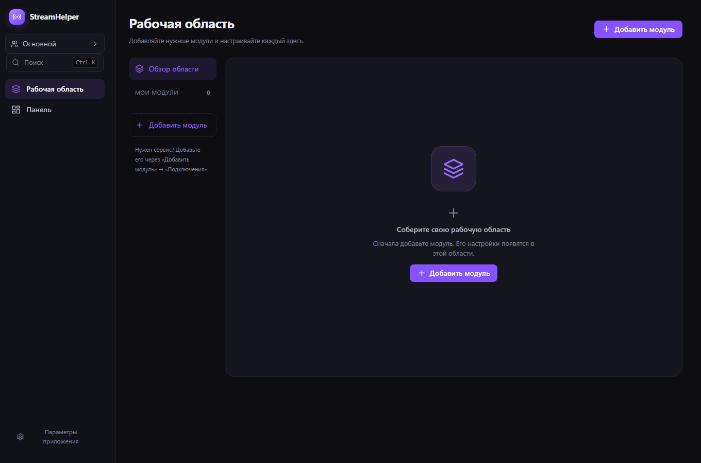
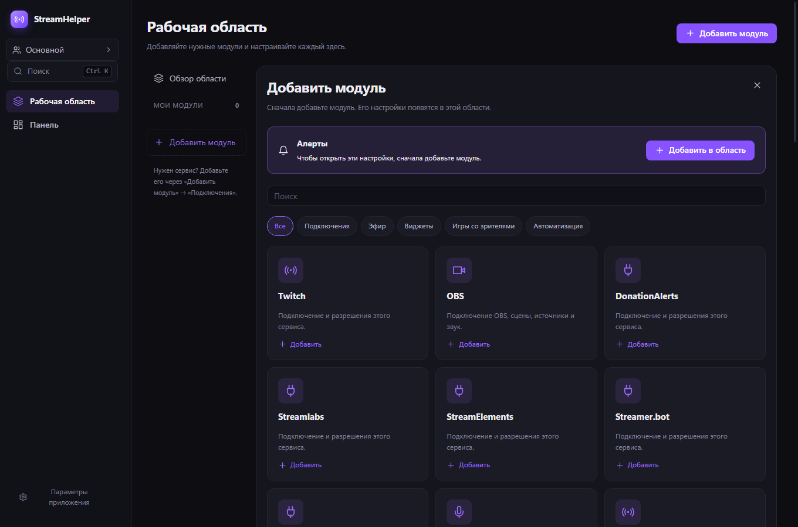
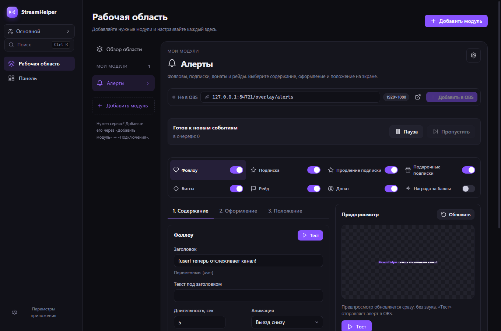
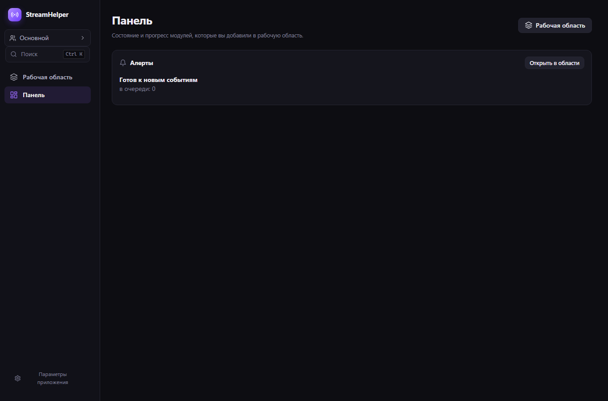

# StreamHelper 0.10.0 — новая логика интерфейса

4 октября 2026. Локальная сборка Windows x64. OBS не запускался, реальные аккаунты и личные настройки не использовались. На момент этой локальной проверки установщик не устанавливался и не публиковался. Все записи, тестовые данные, временные файлы и кеши находятся в этой рабочей копии проекта.

## Как работает приложение

В главной навигации два пункта: **Рабочая область** и **Панель**. Первое открытие новой установки показывает пустую область.

1. Нажмите «Добавить модуль», найдите нужную функцию и добавьте её.
2. Её редактор сразу откроется внутри рабочей области. Слева находятся только добавленные модули.
3. Добавьте нужные подключения отдельно: Twitch, OBS, DonationAlerts и другие сервисы. Настройки каждого сервиса находятся в его модуле.
4. Панель показывает состояние и прогресс уже добавленных функций: цели, таймеры, счётчики, очереди, результаты игр, чат и события. На панели нет форм конфигурации.

37 модулей охватывают все существующие функции. Отправка сообщений и модерация находятся в модуле чата; журнал событий и повтор алертов — в модуле событий; пауза, продолжение и пропуск алерта — в модуле алертов. Каждая игра добавляется отдельно. Настройки OBS, быстрых действий и SubForStream разделены. Сброс алертов, бота, чата и действий перенесён в меню соответствующего модуля и требует подтверждения. Он выполняется после ожидающих записей формы, поэтому свежий ввод не отменяет сброс. Глобальные параметры приложения и управление профилями открываются в небольших окнах и не содержат настройки отдельных функций.

Удаление модуля немедленно закрывает его редактор. Повторное добавление возвращает сохранённую конфигурацию. Удаление из области само по себе сохраняет работу существующих источников и сервисов; для остановки используйте выключение или отключение внутри модуля. Профиль хранит отдельный список модулей; копирование профиля копирует и этот список. Старые карточки «Активности» и «Счётчики» преобразуются в отдельные поддерживаемые модули.

## Проверка доступа

Доступ к редактору определяется текущим списком модулей на каждом отображении интерфейса. Проверка распространяется на:

- основной список модулей и каталог;
- Ctrl+K и оперативные команды;
- старые ссылки на оверлеи, интерактив и подключения;
- сохранённую навигацию после перезапуска;
- удаление модуля и переключение профиля;
- изменения настроек, полученные от основного процесса.

Если старый переход указывает на отсутствующий модуль, появляется предложение добавить его. Переход сам ничего не добавляет и не открывает редактор. Старые отдельные страницы со списками всех настроек удалены.

## Результаты проверки

- `npm run typecheck` — без ошибок.
- `npm test` — **198 тестов в 23 файлах**, все прошли. Проверены миграция списков, независимость профилей и разрешение старых переходов.
- `npm run build` — производственная сборка.
- `npm run test:ui` — реальный Electron с отдельной тестовой папкой, искусственными данными, локальным сервером и запретом внешних запросов.
- UI-тест открывает **все 37 редакторов** через каталог, проверяет пустую область, два пункта навигации, поиск, старые ссылки, удаление/возврат, смену профиля, область глобальных параметров, отмену и подтверждение сброса только выбранного модуля, отсутствие форм на панели, русский и английский интерфейсы, ввод пробелов в боте, заказ песни и ширину окна 1000 px.
- Дополнительно проверены отправка сообщения из модуля чата, переключение в его настройки без лишнего предпросмотра и пауза/продолжение/пропуск в локальной очереди алертов.
- 20 быстрых изменений координаты алерта объединяются в одну запись; сохраняется последнее значение.
- **30 DOM-проверок алертов**: три размера источника, пять привязок, два расположения картинки, длинные имена и сообщения; текст и картинка остаются в безопасных границах.
- Нет ошибок консоли React. Пакет и установщик проверены локально скриптами `verify-package.cjs` и `publish-release.ps1 -ValidateOnly -AllowUnsigned`.

Сохранены backend-исправления предыдущего этапа: восстановление источников OBS, события Twitch только от Twitch, нормализация DonationAlerts, заказы музыки из чата и за баллы, отдельный аккаунт бота, надёжность переподключения и оптимизации. Подробности и ограничения интеграций: [отчёт 0.9.0](verification-0.9.0.md).

## Нагрузка и границы проверки

Пустая область не создаёт предпросмотры. Монтируется один выбранный редактор; остальные загружаются при открытии. Панель использует текст, числа и полосы прогресса, без iframe-предпросмотров. Начальный JavaScript — примерно 386 kB по Vite, без сжатия. Удалён старый общий экран с одновременно открытыми настройками и активностями.

Реальная нагрузка CPU/GPU/RAM во время стрима и работа с вашими OBS/Twitch/DonationAlerts остаются для живой проверки на вашей стороне. Тестовый запуск не авторизует сервисы, не управляет установленным OBS и не отправляет сообщения в реальные чаты. Установщик Windows без подписи издателя.

## Локальный установщик

`dist/0.10.0/StreamHelper-Setup-0.10.0.exe`

SHA256: `22700dd8b823cf363879f19c9c0daabf35627ba418fcb2471cca701a6af3b963`.

Аудит подтвердил побайтовое совпадение **24 файлов собранного приложения** и **28 файлов оверлеев**, наличие Windows-медиабиндингов и нативной библиотеки x64, версии пакета и установщика, а также контрольных сумм в `latest.yml` и `SHA256SUMS.txt`. Машинные отчёты: [UI](ui-results-0.10.0.json) и [пакет](package-verification-0.10.0.json).
