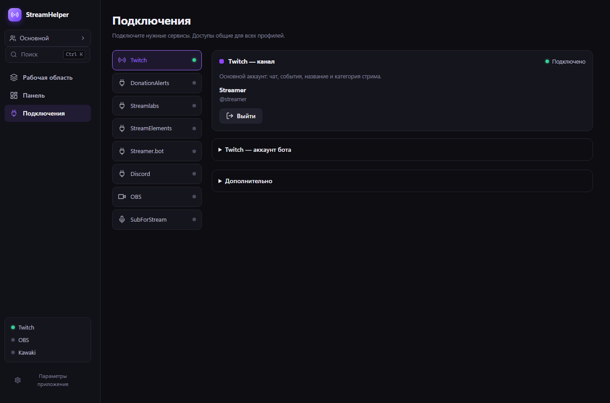
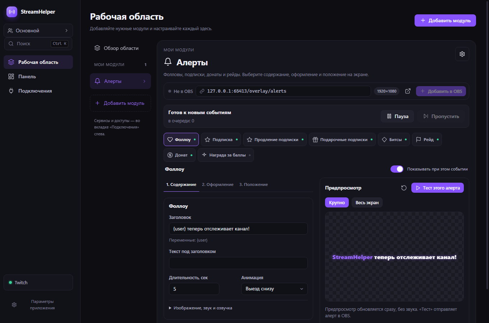
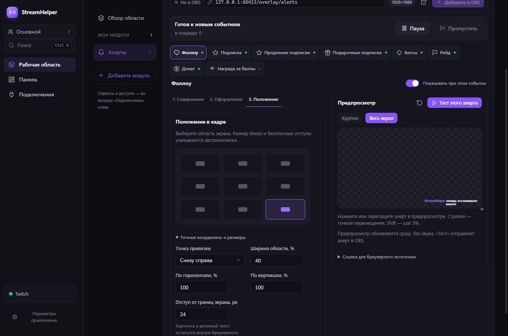
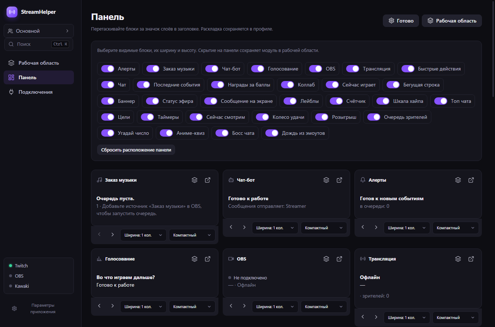

# Проверки StreamHelper 0.10.1

Дата: 4 октября 2026. Локальная сборка Windows x64. Реальные аккаунты, OBS и установленный пользовательский StreamHelper не запускались и не использовались. Временные файлы, данные Electron и кэш сборки находятся внутри проекта.

## Изменения по обратной связи

1. Подключения — отдельная вкладка левого меню с восемью редакторами. Аккаунт бота находится внутри подключения Twitch. Управление сценами и звуком OBS остаётся отдельным модулем рабочей области. Сохранённые подключения не теряются при переходе с 0.10.0.
2. Панель: перетаскивание за значок слоёв, изменение ширины и высоты, скрытие блоков, сброс раскладки. Порядок панели независим от порядка модулей; скрытие сохраняет сам модуль. Раскладка входит в настройки профиля, мигрирует и восстанавливается после перезапуска.
3. Профили: «Новый профиль» создаёт пустую область со стандартными настройками функций. «Создать копию» дублирует текущую конфигурацию и раскладку. Авторизация сервисов остаётся общей.
4. Все тесты событий отдельных виджетов и алертов обходят общую шину реальных событий. Поэтому они не запускают дождь из эмоутов и другие эффекты, не увеличивают цели и не вызывают сценарии. Реальные события и отдельная кнопка теста дождя продолжают работать. Тест обычного доната не выбирает уровень; тест уровня проверяет именно выбранный ID, включая одинаковые пороги и выключенные варианты.
5. Карточки каталога и установленных модулей уменьшены; в UI проверена высота менее 145 px.
6. Twitch: аккаунт бота с тем же ID, что у стримера, больше не помечает все ручные сообщения стримера как собственные ответы приложения. Автоматические ответы распознаются по ID и временной записи отправки, в том числе если EventSub опережает HTTP-ответ. Команды вещателя проверены при offline-состоянии. Отдельный аккаунт бота сохраняет свой токен и отправителя.
7. Алерты: выбор события сверху, один переключатель его включения, две колонки, крупный и полный предпросмотр. Тест доступен в заголовке предпросмотра на всех шагах. Медиа, дополнительные параметры оформления и точные координаты раскрываются отдельно. Положение меняется мышью, стрелками или пресетами. Крупный режим получает реальную геометрию содержимого оверлея и увеличивает её; источник OBS не изменяется.

## Результаты

- `npm run typecheck` — успешно.
- `npm test` — **217 тестов в 24 файлах**, успешно.
- `npm run test:ui` — производственная сборка и изолированный Electron, успешно. **30 редакторов модулей, 8 редакторов подключений**; пустая область, старые маршруты, поиск, удаление/возврат модулей, чистый и скопированный профили, переключение профилей, перетаскивание/размеры/скрытие панели и её восстановление после перезапуска, русский/английский интерфейс и окно 1000×740.
- Проверены тесты виджетов при активном обработчике дождя: только целевой оверлей получает сообщение. Проверены пауза, продолжение и пропуск очереди алертов; быстрые правки настроек объединяются.
- Перетаскивание положения алерта проверено нативными событиями мыши Electron. Крупный предпросмотр увеличивает содержимое; **30 проверок реальной DOM-геометрии алертов** на размерах 320×180, 1280×720 и 1920×1080 подтвердили безопасные границы при длинном тексте и большом изображении.
- Машинный UI-отчёт: [ui-results-0.10.1.json](ui-results-0.10.1.json). Аудит упакованного приложения: [package-verification-0.10.1.json](package-verification-0.10.1.json).
- Тест алерта ждёт сохранения последних правок; проверен ввод нового шаблона и клик теста в том же цикле обработки событий. Миграция старого профиля без настроек панели создаёт пустую раскладку, не копируя раскладку активного профиля.

## Скриншоты

Демонстрационные данные; реальных логинов, токенов или настроек пользователя нет.

## Границы проверки

Итоговый установщик: `dist/0.10.1/StreamHelper-Setup-0.10.1.exe`. SHA256: `fc622599754df2369e98d1e2be13854d22ca9724441211315505a0add65280a6`.

Аудит подтвердил версию 0.10.1, побайтовое совпадение 24 файлов сборки и 28 файлов оверлеев, наличие двух нативных файлов с правильной архитектурой и совпадение контрольных сумм SHA256/SHA512 с файлами выпуска. `publish-release.ps1 -ValidateOnly -AllowUnsigned` завершился успешно.

Сетевые протоколы и сообщения Twitch проверены на изолированных данных; вход в настоящий Twitch, события реального эфира и отправка сообщений в настоящий чат не выполнялись. OBS не запускался; работу с его источниками после установки пользователь проверяет на своей конфигурации. Установщик Windows не подписан сертификатом издателя.
