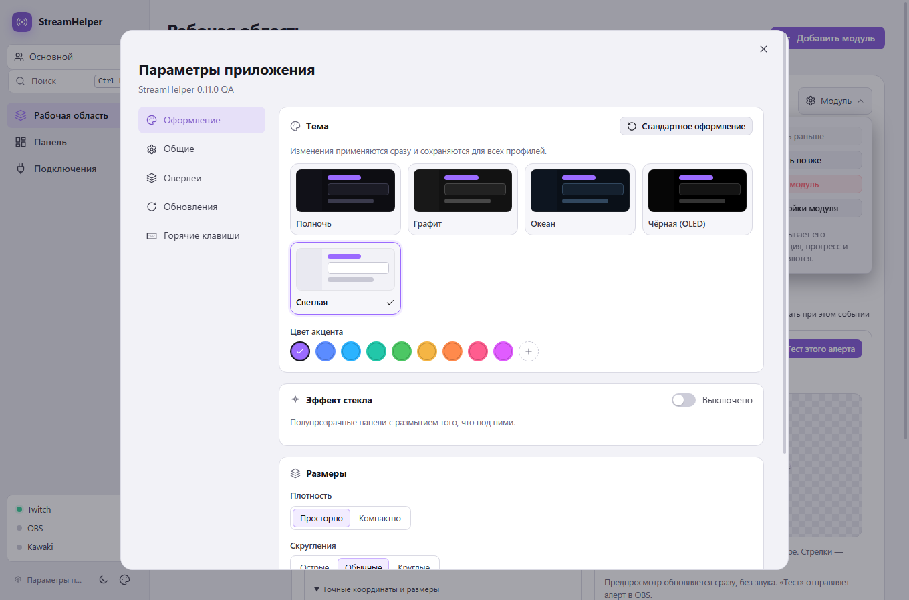

# Проверки StreamHelper 0.11.0

Дата: 9 октября 2026. Локальная сборка Windows x64. Реальные аккаунты, OBS и установленный пользовательский StreamHelper не запускались и не использовались.

## Изменения

1. Заказ музыки: проверка ссылок через YouTube oEmbed до постановки в очередь, ответы зрителям в чате, пропуск невоспроизводимых видео вместо остановки очереди. Очередь с обложками, перетаскиванием, «Включить сейчас», «Поставить следующим», паузой и продолжением.
2. Награда, созданная из приложения (доступ `channel:manage:redemptions`): возврат баллов за отклонённые, невоспроизводимые и удалённые заказы, отметка о выполнении сыгранных. Сообщение «Баллы возвращены» отправляется только после того, как Twitch принял возврат; для наград, созданных вручную в панели Twitch, возврат не обещается.
3. «Кто слышит музыку»: режим прослушивания OBS для источников «Заказ музыки». По умолчанию — «Только зрители», что совпадает с режимом OBS без настроек и не меняет звук существующих установок.
4. Оформление: вкладки параметров, пять тем, акцент, стекло с Mica/Acrylic на Windows 11 22H2+, плотность, скругления, масштаб, отключение анимаций, горячие клавиши.
5. Панель: свободная сетка из 12 колонок, перетаскивание за заголовок, изменение размера за угол, управление с клавиатуры, отсутствие перекрытий, «Убрать пустоты», миграция старых раскладок.
6. Исправления: прокрутка окна переключателями, ложные щелчки по полям с несколькими элементами, границы ошибок отрисовки, двойной предпросмотр Kawaki, перезапуск предпросмотра алерта, одинаковые ID сегментов колеса.

## Обновление с 0.10.x

- Для создания награды и возврата баллов Twitch нужно переподключить. Без этого остальные функции работают, а кнопка создания награды показывает понятную ошибку.
- При каждом подключении к OBS режим прослушивания источников «Заказ музыки» выставляется по выбору в модуле. Ручная настройка прослушивания этого источника в OBS перезаписывается.

## Результаты

- `npm run typecheck` — успешно.
- `npm test` — **230 тестов в 25 файлах**, успешно. Новые тесты: сетка панели и миграция раскладок, проверка и отклонение ссылок, возврат и выполнение наград, отказ Twitch в возврате без обещания в чате, пропуск невоспроизводимого видео, режимы прослушивания OBS.
- `npm run test:ui` — производственная сборка и изолированный Electron, успешно. **30 редакторов модулей, 8 редакторов подключений**; выбор «Кто слышит музыку», переупорядочивание очереди, свободная сетка с перетаскиванием и изменением размера настоящими событиями указателя, перемещение с клавиатуры, отсутствие перекрытий до и после перезапуска, смена тем и включение стекла, английский интерфейс и 30 случаев геометрии алертов.
- Машинный UI-отчёт: [ui-results-0.11.0.json](ui-results-0.11.0.json). Аудит упакованного приложения: [package-verification-0.11.0.json](package-verification-0.11.0.json).

## Скриншоты

Демонстрационные данные; реальных логинов, токенов или настроек пользователя нет.

## Границы проверки

Итоговый установщик: `dist/0.11.0/StreamHelper-Setup-0.11.0.exe`. SHA256: `e231cb816b9604c7bc14bfcc29290fedb041c6725757531ef12ac6885b143774`.

Аудит подтвердил версию 0.11.0, побайтовое совпадение 23 файлов сборки и 28 файлов оверлеев, наличие двух нативных файлов с правильной архитектурой и совпадение контрольных сумм SHA256/SHA512 с файлами выпуска. `publish-release.ps1 -ValidateOnly -AllowUnsigned` завершился успешно.

Создание награды, возврат баллов и проверка YouTube проверены на изолированных данных; настоящий Twitch и YouTube не вызывались. OBS не запускался: режимы прослушивания проверены на тестовом сервере obs-websocket, звук в эфире и наушниках пользователь проверяет на своей конфигурации. Эффекты Mica/Acrylic проверяются только на Windows 11 22H2+. Установщик Windows не подписан сертификатом издателя.
