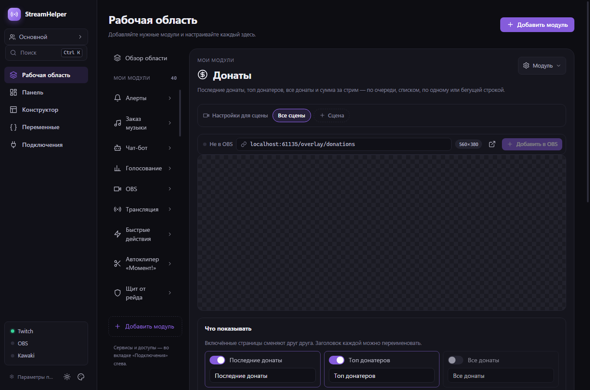

# Проверки StreamHelper 0.12.0

Дата: 9 октября 2026. Локальная сборка Windows x64. Реальные аккаунты, OBS и установленный пользовательский StreamHelper не запускались и не использовались.

## Изменения

1. Выбор шрифта во всех модулях с текстом: 30 встроенных шрифтов с кириллицей (лицензия SIL OFL 1.1, файлы в `resources/overlays/assets/fonts`), шрифты, установленные в системе, и Google Fonts по названию. Шрифт добавлен наградам, коллаборации, музыке, заказу музыки, «Выделить сообщение», целям, рекламе, боссу, ленте событий и статусу эфира.
2. Бегущая строка: ширина 10–100 % источника и выравнивание узкой строки.
3. Модуль «Донаты»: последние, топ донатеров, все донаты и сумма по очереди; список, по одному или бегущая строка; история донатов и переменные `{lastdonations:N}`, `{topdonors:N}`, `{alltimetop:N}`, `{donationcount}`.
4. OBS: «Добавить в OBS» с выбором сцены кладёт источник в группу StreamHelper — вложенную сцену (своя на каждую сцену, общая или без группы). obs-websocket не умеет добавлять элементы в настоящие группы OBS (`CreateSceneItem` — «Scenes only»), поэтому используется рекомендованная OBS замена. Модуль OBS показывает оверлеи StreamHelper во всех сценах, включая группы и вложенные сцены; «Собрать в группу» переносит разбросанные источники с сохранением положения.
5. Настройки для сцены: в модулях оверлеев отдельное оформление для выбранной сцены; хранится только разница с общими настройками, источник в OBS получает параметр `?v=`.
6. Вкладка «Конструктор»: свои оверлеи из текста с переменными, картинок, фигур и виджетов StreamHelper, с перетаскиванием, изменением размера, прилипанием, слоями, отменой и заготовками.
7. Вкладка «Переменные»: встроенные переменные с текущими значениями, свои переменные, счётчики; шаг действия «Изменить переменную».
8. Вход в Kawaki на вкладке «Подключения».
9. Набор «Инструменты стрима» из PR #9 (автоклипер, проклятия, музыкальная дуэль, «Угадай мелодию», приглушение, биржа, портал, итоги стрима, щит от рейда) впервые входит в выпуск.

## Обновление с 0.11.x

- Новые оверлеи «Донаты» и «Свой оверлей» включаются во всех существующих профилях один раз при первом запуске.
- Уже добавленные в OBS источники остаются на месте. Новые попадают во вложенную сцену «StreamHelper · <сцена>»; режим меняется в «Подключениях → OBS».
- Для клипов и щита от рейда Twitch запросит новые разрешения.

## Результаты

- `npm run typecheck` — успешно.
- `npm test` — **294 теста в 28 файлах**, успешно. Новые тесты: совпадение списков встроенных шрифтов в приложении, манифесте и оверлеях и наличие всех файлов шрифтов; разбор списка шрифтов из реестра; журнал донатов без тестовых и повторных событий, топ с суммированием по донатеру, учёт только основной валюты, переменные донатов; свои переменные и `+N/-N`; разница и применение настроек сцены, доставка варианта только источникам с `?v=`; группа StreamHelper на тестовом obs-websocket (создание вложенной сцены, источник в ней, повторное добавление находит его в группе, поиск по сценам); отрисовка оверлея конструктора; миграция новых полей.
- `npm run test:ui` — производственная сборка и изолированный Electron, успешно. **40 редакторов модулей, 9 редакторов подключений** (включая Kawaki), выбор шрифта со встроенными шрифтами, вкладка «Переменные» с добавлением своей переменной, вкладка «Конструктор» с заготовкой, слоями, выделением и свойствами.
- Оверлеи «Донаты», «Свой оверлей», узкая бегущая строка и лента событий со встроенным шрифтом отрисованы в офскрин-окне Electron и проверены по скриншотам.
- Машинный UI-отчёт: [ui-results-0.12.0.json](ui-results-0.12.0.json). Аудит упакованного приложения: [package-verification-0.12.0.json](package-verification-0.12.0.json).

## Скриншоты

Демонстрационные данные; реальных логинов, токенов или настроек пользователя нет.

## Границы проверки

Итоговый установщик: `dist/0.12.0/StreamHelper-Setup-0.12.0.exe`. SHA256: `30350e1f3768cf855d27843b637e7c2d7a0bbfe9712a03cb8acf37652a97a597`.

Аудит подтвердил версию 0.12.0, побайтовое совпадение 29 файлов сборки и 106 файлов оверлеев (включая шрифты), наличие двух нативных файлов с правильной архитектурой и совпадение контрольных сумм SHA256/SHA512 с файлами выпуска. `publish-release.ps1 -ValidateOnly -AllowUnsigned` завершился успешно. Иконка установщика взята из сборки 0.11.0 (`icon.png` не менялся): конвертер иконок electron-builder не смог выделить память под WebAssembly.

Группы и сцены OBS проверены на тестовом сервере obs-websocket; настоящий OBS не запускался, поэтому создание вложенной сцены, «Собрать в группу» и раздельные настройки сцен пользователь проверяет на своей конфигурации. Системные шрифты проверены только разбором вывода реестра; список через PowerShell (`System.Drawing`) работает на машине пользователя. Установщик Windows не подписан сертификатом издателя.
