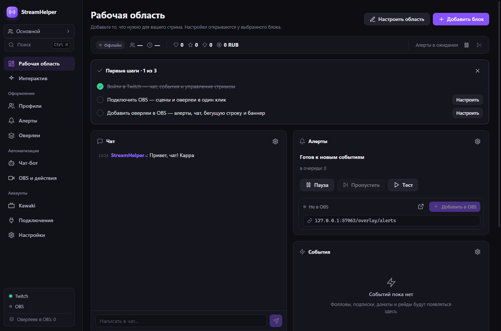
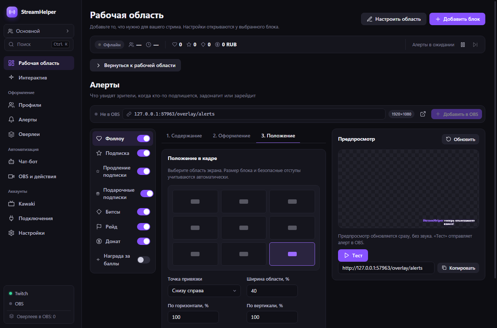

# StreamHelper 0.9.0 — изменения и проверка

Исторический отчёт промежуточного этапа. Эти исправления включены в 0.10.0; актуальный интерфейс и инструкции: [отчёт 0.10.0](verification-0.10.0.md).

Дата: 4 октября 2026. Локальная сборка Windows x64. Изменения выполнены в этой рабочей копии проекта. OBS не запускался; личные настройки и аккаунты не использовались. Установщик не устанавливался и выпуск не публиковался.

## Что сделано по запросу

| Пункт | Результат |
| --- | --- |
| 1. Удобный интерфейс | Рабочая область с каталогом блоков, поиском, добавлением, удалением и изменением порядка. Настройки открываются у выбранного блока. Раскладка отдельная для каждого профиля; пустая область тоже сохраняется. |
| 2. Источники после перезапуска OBS | При подключении OBS восстанавливаются URL локальных источников и перезагружаются страницы. Повторное добавление обновляет и включает существующий источник в сцене. Удалённый источник можно создать снова. Одновременные добавления не создают дубли. Размеры существующего источника сохраняются. |
| 3. Twitch как источник активности | Общая шина событий принимает Twitch-активность только от Twitch. DonationAlerts, Streamlabs и StreamElements могут передавать только донаты. Это применяется к алертам, ленте, статистике, целям, таймерам и боту. |
| 4. Данные DonationAlerts | Обрабатываются вложенные JSON и несколько публикаций в кадре. Проверяются сумма, валюта и тип события; подавляются повторы. Подключение подтверждается после ответа подписки. Конвертация без известной валюты не применяется к целям и порогам. Аудиосообщение не отображается как URL в тексте. |
| 5, 8. Настройка алертов | Три шага: содержание, оформление, положение. Девять позиций, безопасный отступ, размеры медиа и текста, выравнивание, подложка, прозрачность, отступ и скругление. Полный блок ограничивается размерами браузерного источника. Тихий предпросмотр меняется сразу и не отправляет тестовые события в OBS. |
| 6. Оптимизация | Объединение быстрых сохранений и сообщений чата, сохранение ссылок на неизменённые данные после IPC, отказ от пустых обновлений состояния, загрузка тяжёлых страниц при открытии, редкие фоновые опросы музыки, один heartbeat для всех WebSocket-клиентов, ограничение очереди отправки зависшим клиентам, 30 FPS для источников, остановка медиа и таймеров при уходе со страницы. |
| 7. Заказы музыки | Реализованы `!sr` и `!songrequest`, права и пауза между запросами. Можно выбрать награду Twitch по ID; переименование награды не ломает приём. Ошибка отсутствующего ввода ссылки видна в интерфейсе. Потеря источника и ошибка YouTube сохраняют заказ в очереди, возобновляют Windows-плеер и отвергают устаревшие сообщения завершения. После ошибки YouTube нужен ручной повтор. |
| 9. Пробелы в боте | Редактор списков сохраняет текущий текст при наборе, включая конечный пробел и пустую строку. Нормализация выполняется при потере фокуса. |
| 10. Дополнительные проблемы | Исправлены гонки отключения и восстановления аккаунтов, перезапись нового аккаунта старым refresh-токеном, зависание миграции EventSub, неверная отметка повторного ручного сообщения как ответа бота, потеря причины отклонения сообщения Twitch, удаление трека во время паузы Windows-плеера, отсутствие текущего алерта после переподключения, неверные suffix Range-запросы медиа и чтение медиа для HEAD. |
| 11. Ограничения работы | Все файлы сборки, кэши, временные файлы и снимки интерфейса этой работы размещены внутри проекта. Тесты используют локальные симуляторы; OBS не запускался. |
| 12. Отдельный бот | Подключение отдельного аккаунта доступно в разделе бота. Автоответы и сообщения приложения используют его токен и ID. Если сохранённый аккаунт бота отключён, отправка сообщает об ошибке вместо смены отправителя на стримера. Без отдельного аккаунта сохраняется работа от стримера. |

## Проверки

- `npm run typecheck`: основной процесс и React без ошибок TypeScript.
- `npm test`: 22 файла, **192 теста**, все прошли. До изменений: 18 файлов, 129 тестов.
- `npm run build`: производственная сборка выполнена.
- `npm run test:ui`: настоящий Electron и собранный React, отдельные данные и локальный overlay-сервер. Реальные аккаунты и внешние запросы отключены.
- UI: добавление/удаление блока, сохранение настроек после удаления, ручное добавление песни в очередь, открытие алертов внутри области, выбор позиции, предпросмотр, конечные пробелы в таймерах бота, отсутствие горизонтального переполнения при ширине окна 1000 px, отсутствие ошибок консоли.
- Быстрый ввод: 20 изменений координаты подряд дают один `settings:set`, сохраняется последняя координата.
- Геометрия алертов: **30 реальных DOM-сценариев** — 320×180, 1280×720 и 1920×1080; пять привязок; картинка сверху или сбоку; длинное имя и сообщение. Прямоугольники картинки и текста остаются внутри безопасных границ. Дополнительно проверены 240 сочетаний координат в расчёте размещения.
- OBS: локальный сервер протокола obs-websocket v5 проверяет перезаподключение, ремонт старого URL, включение выключенного источника, отсутствие дублей, устаревший кэш сцены и повторное создание после удаления.
- DonationAlerts: локальный WebSocket и имитация API проверяют подтверждение подписки, её отклонение, вложенные публикации, повторную доставку, неверные данные и отключение во время запроса.
- Twitch: имитация Helix и EventSub проверяет токены и отправителя бота, отклонение сообщения, собственное эхо, отключение во время обновления, смену аккаунта во время refresh, восстановление и миграцию EventSub.
- Медиа: проверены обычные, открытые и suffix Range-запросы, недопустимые диапазоны, HEAD и перезапуск сервера с подключёнными источниками.
- `node scripts/verify-package.cjs`: 16 файлов собранного кода и 28 файлов оверлеев побайтово совпадают с проверенной рабочей копией. Windows-медиабиндинги и обе нативные библиотеки включены; библиотека x64 соответствует архитектуре приложения. SHA512 установщика совпадает с `latest.yml`, SHA256 — с `SHA256SUMS.txt`.
- `scripts/publish-release.ps1 -ValidateOnly -AllowUnsigned`: локальные файлы выпуска и версия установщика проверены. Этот вызов не публикует выпуск.

Снимки и машинный результат UI-теста создаются в `dist/qa/`. Скрипт теста: `scripts/test-ui.cjs`.





## Подтверждённые изменения нагрузки

Начальный JavaScript React-сборки уменьшен с 1115,69 до примерно **406,22 kB**; остальные настройки загружаются отдельными файлами при открытии. CSS уменьшен с 60,69 до **46,23 kB**. Это размеры файлов по выводу Vite, без сжатия.

Опрос Windows-медиасеансов: 3 секунды при видимом приложении/активном музыкальном источнике, 15 секунд в фоне, 60 секунд при недоступности медиасеансов. Чат обновляется пачками, сохранения настроек объединяются за 120 мс. Реальный процент CPU/GPU/RAM во время вашего стрима не измерялся; видео, GIF, сторонние шрифты и YouTube продолжают требовать ресурсов в зависимости от выбранных медиа.

## Как пользоваться изменениями

1. В рабочей области нажмите «Добавить блок», выберите нужные блоки. «Настроить область» включает удаление и порядок; шестерёнка открывает настройки блока.
2. В алертах выберите событие и пройдите содержание → оформление → положение. Изменения сразу видны справа. «Проверить» запускает отдельное тестовое событие, а обычный предпросмотр звучать не будет.
3. Для заказов музыки включите функцию, выберите награду Twitch и обязательно включите ввод текста в самой награде. Зритель передаёт ссылку на одно видео YouTube. Для чата включите бота и приём команд: `!sr https://youtu.be/VIDEO_ID`. Префикс берётся из настроек бота.
4. Для отдельного бота откройте настройки бота → аккаунт Twitch. В браузере авторизуйтесь нужным аккаунтом и подключите его. Интерфейс показывает отправителя. Аккаунт стримера остаётся источником событий и управления каналом.
5. При следующей вашей проверке OBS существующие локальные источники должны восстановиться после подключения. Кнопка добавления также обновляет и включает уже существующий источник.

## Что требует живой проверки

Живые события Twitch/DonationAlerts, перезапуск вашего OBS, права конкретных аккаунтов, доступность выбранных видео YouTube и фактическая нагрузка во время стрима не проверялись. Эти сервисы не запускались и ваши токены не считывались.

Если Twitch отклоняет отдельные подписки EventSub, причина показывается в подключениях; можно обновить разрешения аккаунта. В награде нужен ввод ссылки. YouTube может запрещать встраивание или блокировать запуск выбранного видео — такой заказ сохраняется для ручного повтора/удаления. Конкретный редкий случай неверного доната пользователя без исходного пакета пока нельзя считать воспроизведённым; покрыты найденные ошибки обработки протокола.

Проверенные технические основания: [API DonationAlerts](https://www.donationalerts.com/apidoc), [Twitch EventSub](https://dev.twitch.tv/docs/eventsub/eventsub-subscription-types/), [Twitch Send Chat Message](https://dev.twitch.tv/docs/api/reference/#send-chat-message), [YouTube IFrame API](https://developers.google.com/youtube/iframe_api_reference).

## Локальная сборка

Установщик: `dist/0.9.0/StreamHelper-Setup-0.9.0.exe`. Рядом находятся blockmap, `latest.yml` и `SHA256SUMS.txt`. Сборка выполняется с `--publish never`; файлы готовы для ручной установки, автоматические обновления не опубликованы.

Сборка не подписана сертификатом. Установка и запуск приложения из установщика не выполнялись; пакет проверен отдельно от пользовательской конфигурации.

SHA256 установщика:

```text
156590b1dd3a6a6a73bf683d22f6958883f2e53c7893045d50456f1e895cab59
```
